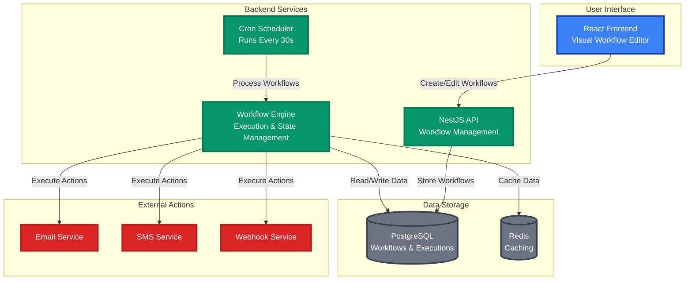
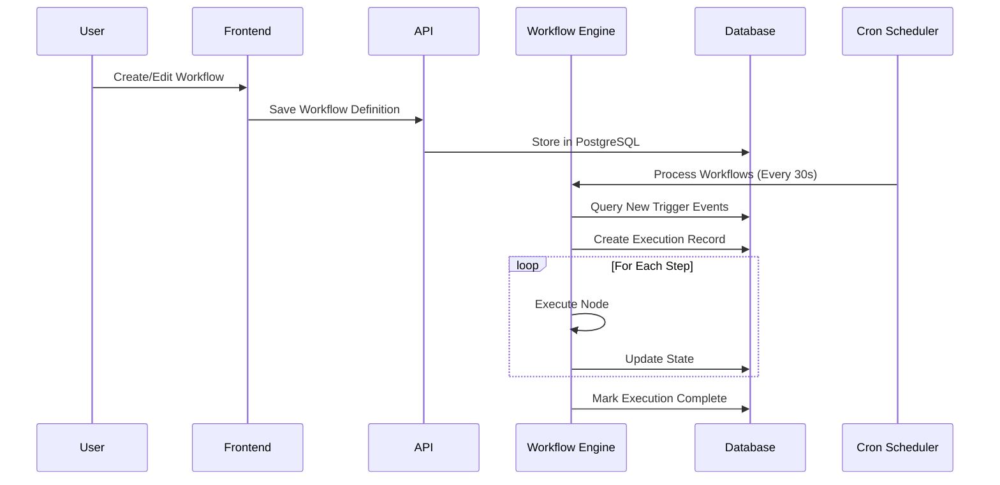

# Workflow Management System

A workflow automation platform built with React and NestJS. This system provides visual workflow creation, execution orchestration, and state management for business processes.

## 🏗️ Architecture Overview

A modern workflow automation platform that enables business users to create complex workflows visually while providing developers with a robust, extensible platform.

### What We Built
- **Visual Workflow Editor**: Drag-and-drop interface for creating business processes
- **Automated Execution**: Cron-based processing every 30 seconds
- **State Management**: Complete workflow state tracking and recovery
- **Extensible Actions**: Email, SMS, webhooks, and custom business logic

### Why This Matters
- **Business Process Automation**: Replace manual workflows with automated ones
- **Developer Productivity**: Visual tools reduce custom code for business logic
- **Scalability**: Handle thousands of workflows and executions
- **Reliability**: Robust error handling and state recovery

## 🎯 Key Features

- **Visual Workflow Editor**: Drag-and-drop interface with React Flow
- **Node-Based Architecture**: Extensible node system with custom executors
- **Real-time Execution**: Cron-based workflow processing every 30 seconds
- **State Persistence**: Complete workflow state tracking and recovery
- **JSON Logic Integration**: Decoupled business logic from visual representation
- **Comprehensive Testing**: Automated test suite with cleanup management

## 🏛️ System Architecture

### High-Level Architecture



### Core Components

#### **4 Main Layers:**

- **🎨 User Interface Layer**
  - React Frontend with React Flow for visual workflow design
  - Real-time workflow monitoring and management

- **⚙️ Backend Services Layer**
  - NestJS API for workflow management
  - Workflow Engine for execution and state management
  - Cron Scheduler for automated processing every 30 seconds

- **💾 Data Storage Layer**
  - PostgreSQL for workflows and executions
  - Redis for caching and session management

- **🌐 External Actions Layer**
  - Email, SMS, and Webhook services for business operations

### Workflow Execution Flow



### Key Technologies

- **Frontend**: React + React Flow + TypeScript
- **Backend**: NestJS + TypeORM + PostgreSQL
- **Scheduling**: Node-cron + Bull Queue
- **State Management**: XState for complex workflows
- **Business Logic**: JSON Logic JS for rule evaluation

## 🔧 Technical Implementation

### Node Executor System

The system uses a plugin-based architecture with 5 specialized node types:

- **Action Node**: Executes business actions (email, SMS, webhook)
- **Delay Node**: Manages workflow suspension and resumption
- **Condition Node**: Evaluates JSON Logic expressions for branching
- **Shared Flow Node**: Executes reusable workflow components
- **Webhook Node**: Triggers external HTTP calls

### JSON Logic Integration

Business rules are decoupled from code using JSON Logic:

```javascript
// Example: Conditional workflow branching
{
  "if": [
    { ">": [{ "var": "user.subscriptionType" }, "premium"] },
    "send_premium_welcome",
    "send_standard_welcome"
  ]
}
```

### Key Features

- **Cron-Based Processing**: Automated execution every 30 seconds
- **State Management**: XState for complex workflow state machines
- **Error Recovery**: Comprehensive retry logic and state persistence
- **Incremental Processing**: Only processes new data since last run

## 🚀 Quick Start

### Prerequisites

- Node.js 18+
- PostgreSQL 13+
- Redis 6+
- Docker & Docker Compose

### Installation

1. **Clone the repository:**
   ```bash
   git clone <repository-url>
   cd workflow-me
   ```

2. **Navigate to docker directory:**
   ```bash
   cd docker
   ```

3. **Start the application:**
   ```bash
   docker-compose up --build
   ```

4. **Access the application:**
   - Frontend: http://localhost:3000
   - Backend API: http://localhost:4000
   - Database: localhost:15432
   - Redis: localhost:16379
   - Adminer (DB Admin): http://localhost:8080

### Development Setup

1. **Backend Development:**
   ```bash
   cd backend
   npm install
   npm run start:dev
   ```

2. **Frontend Development:**
   ```bash
   cd frontend
   npm install
   npm start
   ```

3. **Run Tests:**
   ```bash
   # Backend tests
   cd backend
   npm run test:workflow:build

   # Clear test data
   npm run test:clear
   ```

