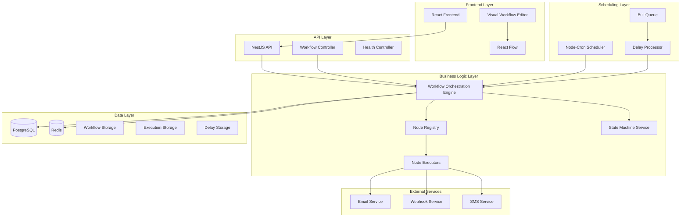
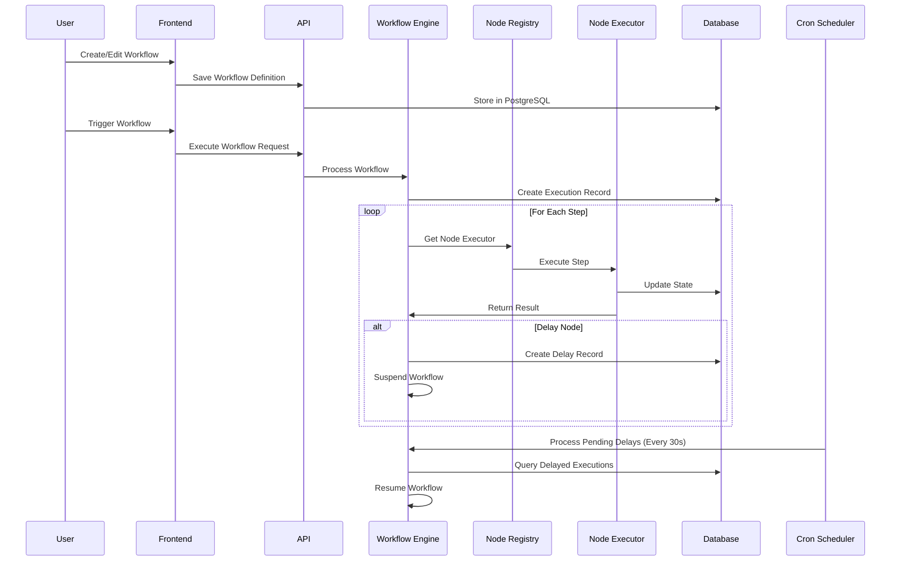
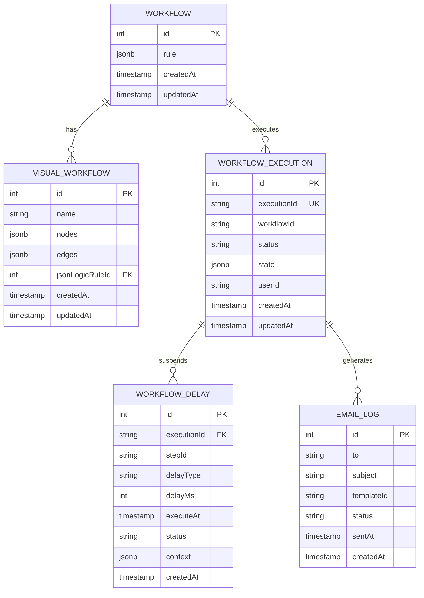
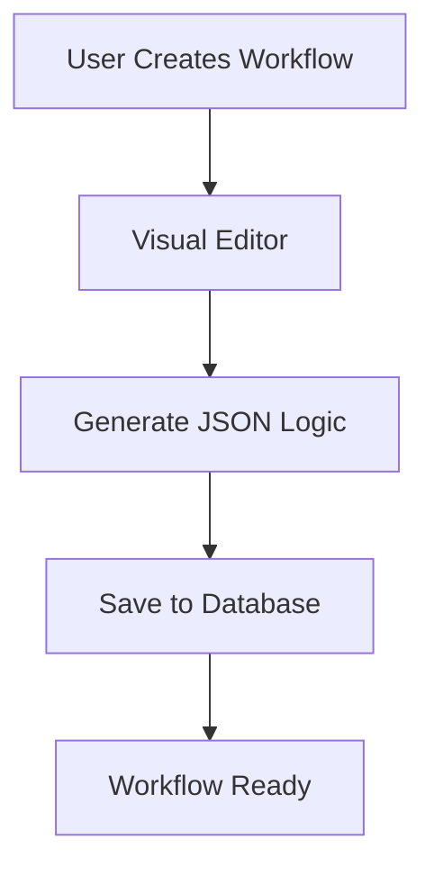
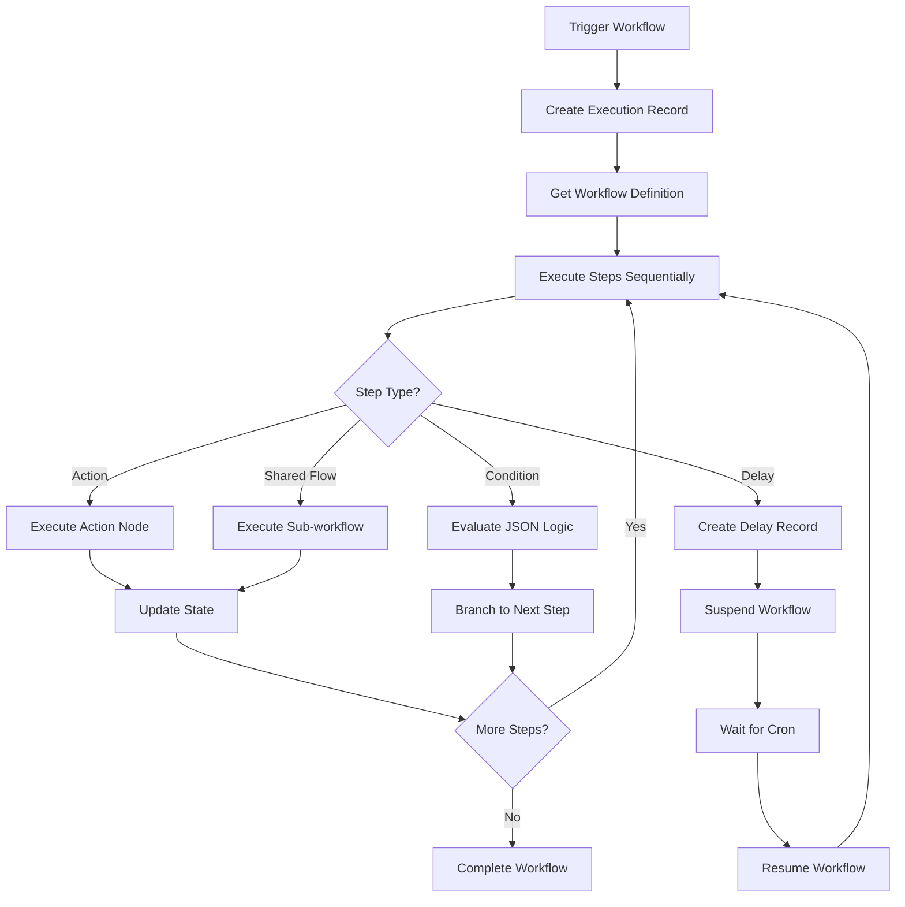
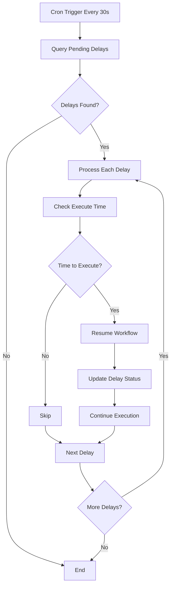

# Workflow Management System

A sophisticated, enterprise-grade workflow automation platform built with React and NestJS. This system provides visual workflow creation, execution orchestration, and comprehensive state management for complex business processes.

## 🏗️ Architecture Overview

The Workflow Management System is built on a microservices architecture with clear separation of concerns, enabling scalable and maintainable workflow automation.

### Core Components

- **Frontend**: React-based visual workflow editor with React Flow
- **Backend**: NestJS API with TypeORM and PostgreSQL
- **Scheduler**: Node-cron based job processing
- **State Management**: XState for complex state machines
- **Logic Engine**: JSON Logic JS for business rule evaluation
- **Storage**: PostgreSQL for persistence, Redis for caching
- **Queue System**: Bull queue for background job processing

## 🎯 Key Features

- **Visual Workflow Editor**: Drag-and-drop interface with React Flow
- **Node-Based Architecture**: Extensible node system with custom executors
- **Real-time Execution**: Cron-based workflow processing every 30 seconds
- **Delay Management**: Sophisticated delay and timing controls
- **State Persistence**: Complete workflow state tracking and recovery
- **JSON Logic Integration**: Decoupled business logic from visual representation
- **Cascade Delete**: Proper data relationship management
- **Comprehensive Testing**: Automated test suite with cleanup management

## 🏛️ System Architecture

### High-Level Architecture



### Workflow Execution Flow



### Database Schema



## 🔧 Technical Implementation

### Workflow Orchestration Engine

The core of the system is the `WorkflowOrchestrationEngine` which handles:

- **Workflow Execution**: Coordinates step-by-step workflow processing
- **State Management**: Tracks workflow state and execution history
- **Error Handling**: Comprehensive error recovery and logging
- **Cron Scheduling**: Automated workflow processing every 30 seconds
- **Delay Processing**: Manages suspended workflows and delayed execution

### Node Executor System

The system uses a plugin-based architecture with specialized node executors:

#### Available Node Types

1. **Action Node** (`action-node.executor.ts`)
   - Executes business actions (email, SMS, webhook)
   - Supports template-based content generation
   - Handles external service integration

2. **Delay Node** (`delay-node.executor.ts`)
   - Manages workflow suspension and resumption
   - Supports multiple delay types (fixed, random, custom)
   - Integrates with cron scheduler for timing

3. **Condition Node** (`condition-node.executor.ts`)
   - Evaluates JSON Logic expressions
   - Enables conditional workflow branching
   - Supports complex business rule evaluation

4. **Shared Flow Node** (`shared-flow-node.executor.ts`)
   - Executes reusable workflow components
   - Enables workflow composition and modularity
   - Supports parameter passing and result handling

5. **Webhook Node** (`webhook-node.executor.ts`)
   - Triggers external webhook calls
   - Handles HTTP request/response processing
   - Supports authentication and retry logic

### JSON Logic Integration

The system uses `json-logic-js` for business rule evaluation:

```javascript
// Example JSON Logic rule
{
  "if": [
    { ">": [{ "var": "user.subscriptionType" }, "premium"] },
    "send_premium_welcome",
    "send_standard_welcome"
  ]
}
```

### Cron-Based Processing

The system uses `@nestjs/schedule` with `node-cron` for:

- **Batch Processing**: Every 30 seconds
- **Delay Processing**: Resuming suspended workflows
- **Cleanup Tasks**: Database maintenance and cleanup
- **Health Checks**: System monitoring and alerting

### State Management with XState

Complex workflows use XState for state machine management:

```typescript
// Example state machine
const workflowMachine = createMachine({
  id: 'workflow',
  initial: 'idle',
  states: {
    idle: { on: { START: 'running' } },
    running: { on: { COMPLETE: 'completed', FAIL: 'failed' } },
    completed: { type: 'final' },
    failed: { type: 'final' }
  }
});
```

## 🚀 Quick Start

### Prerequisites

- Node.js 18+
- PostgreSQL 13+
- Redis 6+
- Docker & Docker Compose

### Installation

1. **Clone the repository:**
   ```bash
   git clone <repository-url>
   cd workflow-me
   ```

2. **Navigate to docker directory:**
   ```bash
   cd docker
   ```

3. **Start the application:**
   ```bash
   docker-compose up --build
   ```

4. **Access the application:**
   - Frontend: http://localhost:3000
   - Backend API: http://localhost:4000
   - Database: localhost:5432
   - Redis: localhost:6379

### Development Setup

1. **Backend Development:**
   ```bash
   cd backend
   npm install
   npm run start:dev
   ```

2. **Frontend Development:**
   ```bash
   cd frontend
   npm install
   npm start
   ```

3. **Run Tests:**
   ```bash
   # Backend tests
   cd backend
   npm run test:workflow:build

   # Clear test data
   npm run test:clear
   ```

## 📊 Workflow Processing Flow

### 1. Workflow Creation



### 2. Workflow Execution



### 3. Delay Processing



## 🧪 Testing Architecture

The system includes comprehensive testing with:

### Test Types

1. **Unit Tests**: Individual component testing
2. **Integration Tests**: Workflow execution testing
3. **Build Tests**: Automated workflow validation
4. **Cleanup Tests**: Safe data management

### Test Data Management

- **Test Prefix**: All test data uses `test-` prefix
- **Safe Cleanup**: Only test data is removed during cleanup
- **Isolation**: Tests don't affect production data
- **Automation**: Tests run on every build

### Running Tests

```bash
# Run all tests
npm run test:workflow:build

# Clear test data
npm run test:clear

# Run specific test suite
npm run test:workflow
```

## 🔒 Security & Data Management

### Data Safety

- **Test Data Isolation**: Production data is never affected by tests
- **Cascade Delete**: Proper foreign key relationship management
- **Transaction Safety**: Database operations are wrapped in transactions
- **Error Recovery**: Comprehensive error handling and rollback

### Security Features

- **Input Validation**: All inputs are validated before processing
- **SQL Injection Prevention**: TypeORM parameterized queries
- **CORS Configuration**: Proper cross-origin resource sharing
- **Environment Variables**: Sensitive data stored in environment variables

## 📈 Performance & Scalability

### Performance Optimizations

- **Database Indexing**: Optimized queries with proper indexes
- **Connection Pooling**: Efficient database connection management
- **Caching**: Redis-based caching for frequently accessed data
- **Batch Processing**: Efficient bulk operations

### Scalability Features

- **Horizontal Scaling**: Stateless architecture supports multiple instances
- **Queue System**: Bull queue for background job processing
- **Microservices Ready**: Modular architecture supports service separation
- **Load Balancing**: API designed for load balancer integration

## 🛠️ Configuration

### Environment Variables

```bash
# Database Configuration
DB_HOST=localhost
DB_PORT=5432
DB_USER=workflow_user
DB_PASSWORD=workflow_password
DB_NAME=workflow_db

# Redis Configuration
REDIS_HOST=localhost
REDIS_PORT=6379

# Application Configuration
NODE_ENV=development
PORT=4000
```

### Database Configuration

```typescript
TypeOrmModule.forRoot({
  type: 'postgres',
  host: process.env.DB_HOST || 'localhost',
  port: parseInt(process.env.DB_PORT || '5432'),
  username: process.env.DB_USER || 'workflow_user',
  password: process.env.DB_PASSWORD || 'workflow_password',
  database: process.env.DB_NAME || 'workflow_db',
  entities: [/* ... */],
  synchronize: process.env.NODE_ENV !== 'production',
  logging: process.env.NODE_ENV === 'development'
})
```

## 🔍 Monitoring & Debugging

### Logging

- **Structured Logging**: JSON-formatted logs for easy parsing
- **Log Levels**: Debug, Info, Warn, Error levels
- **Context Tracking**: Execution IDs for request tracing
- **Performance Metrics**: Execution time and resource usage

### Health Checks

- **Database Health**: Connection and query performance
- **Redis Health**: Cache availability and performance
- **Service Health**: External service availability
- **Workflow Health**: Active workflow monitoring

## 🚀 Deployment

### Docker Deployment

```yaml
version: '3.8'
services:
  app:
    build: .
    ports:
      - "4000:4000"
    environment:
      - NODE_ENV=production
    depends_on:
      - postgres
      - redis

  postgres:
    image: postgres:13
    environment:
      POSTGRES_DB: workflow_db
      POSTGRES_USER: workflow_user
      POSTGRES_PASSWORD: workflow_password

  redis:
    image: redis:6-alpine
```

### Production Considerations

- **Environment Variables**: Use secure environment variable management
- **Database Backups**: Regular automated backups
- **Monitoring**: Application performance monitoring
- **Scaling**: Horizontal scaling with load balancers
- **Security**: HTTPS, authentication, and authorization

## 📚 API Documentation

### Workflow Management

- `POST /workflows` - Create workflow
- `GET /workflows` - List workflows
- `GET /workflows/:id` - Get workflow details
- `PUT /workflows/:id` - Update workflow
- `DELETE /workflows/:id` - Delete workflow

### Execution Management

- `POST /workflows/:id/execute` - Execute workflow
- `GET /executions` - List executions
- `GET /executions/:id` - Get execution details
- `POST /executions/:id/pause` - Pause execution
- `POST /executions/:id/resume` - Resume execution
- `POST /executions/:id/cancel` - Cancel execution

### Health & Monitoring

- `GET /health` - Health check
- `GET /metrics` - Performance metrics
- `GET /logs` - System logs

## 🤝 Contributing

1. Fork the repository
2. Create a feature branch
3. Make your changes
4. Add tests for new functionality
5. Ensure all tests pass
6. Submit a pull request

## 📄 License

This project is licensed under the MIT License - see the LICENSE file for details.

## 🆘 Support

For support and questions:

- Create an issue in the repository
- Check the documentation
- Review the test examples
- Contact the development team

---

**Built with ❤️ using React, NestJS, TypeORM, PostgreSQL, Redis, and modern web technologies.**