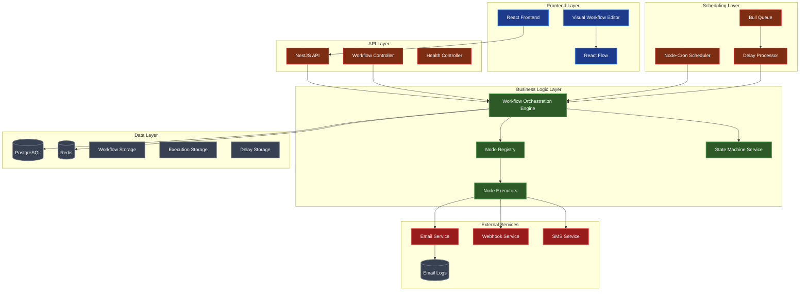

# Workflow Management System

A workflow automation platform built with React and NestJS. This system provides visual workflow creation, execution orchestration, and state management for business processes.

## 🏗️ Architecture Overview

The Workflow Management System is built on a microservices architecture with clear separation of concerns, enabling scalable and maintainable workflow automation.

### Core Components

- **Frontend**: React-based visual workflow editor with React Flow
- **Backend**: NestJS API with TypeORM and PostgreSQL
- **Scheduler**: Node-cron based job processing with per-workflow execution tracking
- **State Management**: XState for complex state machines
- **Logic Engine**: JSON Logic JS for business rule evaluation
- **Storage**: PostgreSQL for persistence, Redis for caching
- **Queue System**: Bull queue for background job processing

## 🎯 Key Features

- **Visual Workflow Editor**: Drag-and-drop interface with React Flow
- **Node-Based Architecture**: Extensible node system with custom executors
- **Real-time Execution**: Cron-based workflow processing every 30 seconds
- **Delay Management**: Sophisticated delay and timing controls
- **State Persistence**: Complete workflow state tracking and recovery
- **JSON Logic Integration**: Decoupled business logic from visual representation
- **UUID-Based Architecture**: Globally unique identifiers for data integrity
- **Cascade Delete**: Proper data relationship management
- **Comprehensive Testing**: Automated test suite with cleanup management

## 🏛️ System Architecture

### High-Level Architecture



### Workflow Execution Flow


### User Creation Workflow Data Flow


### Database Schema


### Scheduler Architecture

The workflow system uses a sophisticated scheduling mechanism that tracks execution times per workflow:

#### Per-Workflow Execution Tracking
- **`workflow_executions_schedule`** table stores the last execution time for each workflow
- **Persistent State**: Survives system restarts and maintains execution history
- **Trigger-Specific**: Each workflow can have different trigger types (user_created, subscription_changed, etc.)
- **Incremental Processing**: Only processes new data since last execution

#### Execution Flow
1. **Cron Trigger**: Every 30 seconds, the scheduler activates
2. **Workflow Iteration**: For each active workflow, check its last execution time
3. **Data Query**: Query for new trigger data since last execution
4. **Execution**: Process each new trigger with the workflow
5. **State Update**: Update the last execution time for the workflow

#### Recovery Mechanism
- **Startup Recovery**: On system restart, recovery service resumes interrupted workflows
- **Delay Processing**: Processes any pending delays that were scheduled before restart
- **State Validation**: Ensures workflow state consistency after recovery

### External Services

The workflow system integrates with external services for business operations:

- **Email Service** - Handles email sending and logging (separate concern)
- **SMS Service** - Handles SMS notifications (future)
- **Webhook Service** - Triggers external webhooks (future)
- **Notification Service** - Centralized notification management (future)

### Separation of Concerns

The architecture follows a clean separation of concerns:

#### **Core Workflow System**
- Workflow definitions and execution
- State management and persistence
- Node executor coordination
- Delay and timing management

#### **External Services**
- Email sending and logging
- SMS notifications
- Webhook triggers
- External API integrations

This separation allows for:
- **Independent scaling** of services
- **Technology flexibility** for each service
- **Clear boundaries** between concerns
- **Easier testing** and maintenance

## 🔧 Technical Implementation


### Workflow Orchestration Engine

The core of the system is the `WorkflowOrchestrationEngine` which handles:

- **Workflow Execution**: Coordinates step-by-step workflow processing
- **State Management**: Tracks workflow state and execution history
- **Error Handling**: Comprehensive error recovery and logging
- **Cron Scheduling**: Automated workflow processing every 30 seconds
- **Delay Processing**: Manages suspended workflows and delayed execution

### Node Executor System

The system uses a plugin-based architecture with specialized node executors:

#### Available Node Types

1. **Action Node** (`action-node.executor.ts`)
   - Executes business actions (email, SMS, webhook)
   - Supports template-based content generation
   - Handles external service integration

2. **Delay Node** (`delay-node.executor.ts`)
   - Manages workflow suspension and resumption
   - Supports multiple delay types (fixed, random, custom)
   - Integrates with cron scheduler for timing

3. **Condition Node** (`condition-node.executor.ts`)
   - Evaluates JSON Logic expressions
   - Enables conditional workflow branching
   - Supports complex business rule evaluation

4. **Shared Flow Node** (`shared-flow-node.executor.ts`)
   - Executes reusable workflow components
   - Enables workflow composition and modularity
   - Supports parameter passing and result handling

5. **Webhook Node** (`webhook-node.executor.ts`)
   - Triggers external webhook calls
   - Handles HTTP request/response processing
   - Supports authentication and retry logic

### JSON Logic Integration

The system uses `json-logic-js` for business rule evaluation:

```javascript
// Example JSON Logic rule
{
  "if": [
    { ">": [{ "var": "user.subscriptionType" }, "premium"] },
    "send_premium_welcome",
    "send_standard_welcome"
  ]
}
```

### Cron-Based Processing

The system uses `@nestjs/schedule` with `node-cron` for:

- **Batch Processing**: Every 30 seconds
- **Delay Processing**: Resuming suspended workflows
- **Cleanup Tasks**: Database maintenance and cleanup
- **Health Checks**: System monitoring and alerting

### State Management with XState

Complex workflows use XState for state machine management:

```typescript
// Example state machine
const workflowMachine = createMachine({
  id: 'workflow',
  initial: 'idle',
  states: {
    idle: { on: { START: 'running' } },
    running: { on: { COMPLETE: 'completed', FAIL: 'failed' } },
    completed: { type: 'final' },
    failed: { type: 'final' }
  }
});
```

## 🚀 Quick Start

### Prerequisites

- Node.js 18+
- PostgreSQL 13+
- Redis 6+
- Docker & Docker Compose

### Installation

1. **Clone the repository:**
   ```bash
   git clone <repository-url>
   cd workflow-me
   ```

2. **Navigate to docker directory:**
   ```bash
   cd docker
   ```

3. **Start the application:**
   ```bash
   docker-compose up --build
   ```

4. **Access the application:**
   - Frontend: http://localhost:3000
   - Backend API: http://localhost:4000
   - Database: localhost:15432
   - Redis: localhost:16379
   - Adminer (DB Admin): http://localhost:8080

### Development Setup

1. **Backend Development:**
   ```bash
   cd backend
   npm install
   npm run start:dev
   ```

2. **Frontend Development:**
   ```bash
   cd frontend
   npm install
   npm start
   ```

3. **Run Tests:**
   ```bash
   # Backend tests
   cd backend
   npm run test:workflow:build

   # Clear test data
   npm run test:clear
   ```

